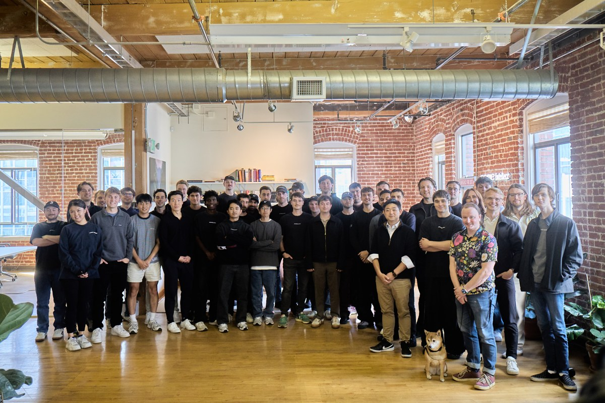
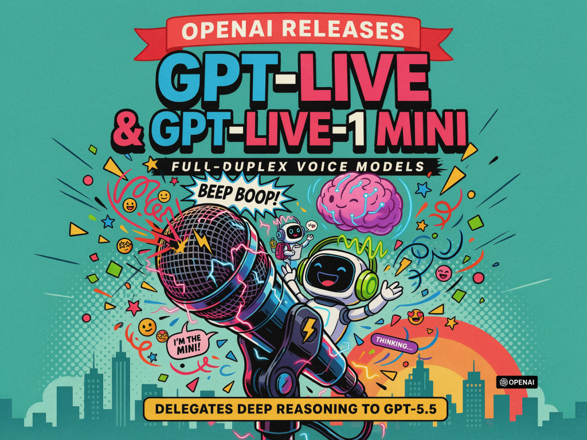
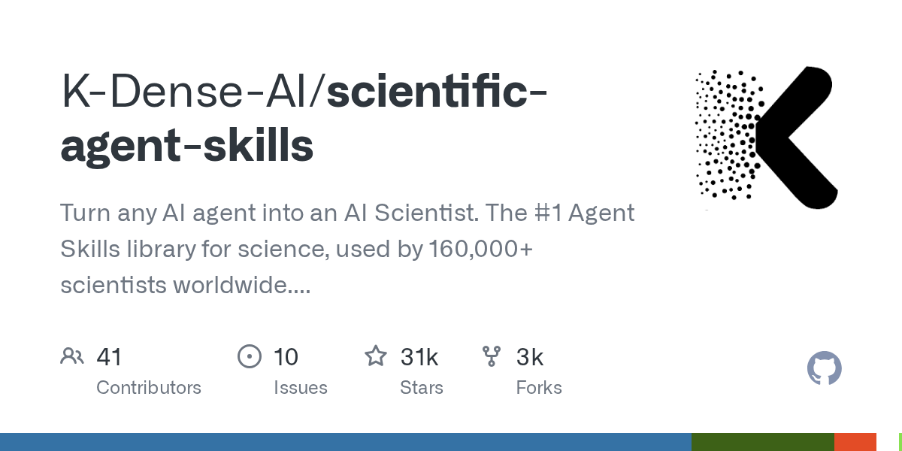
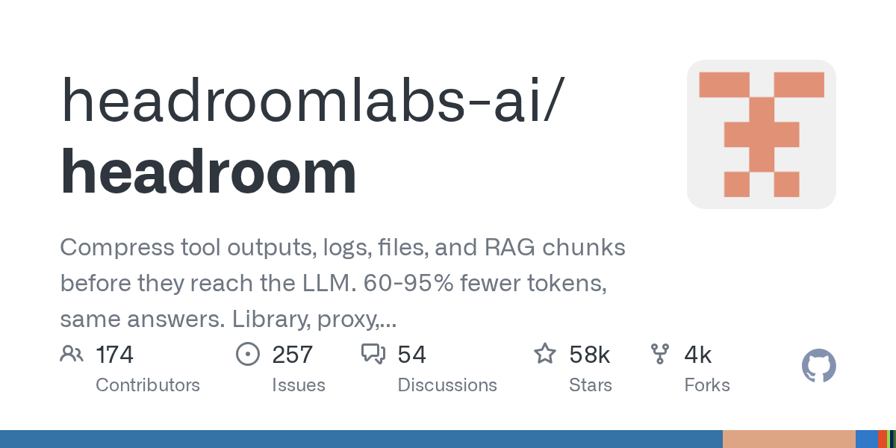
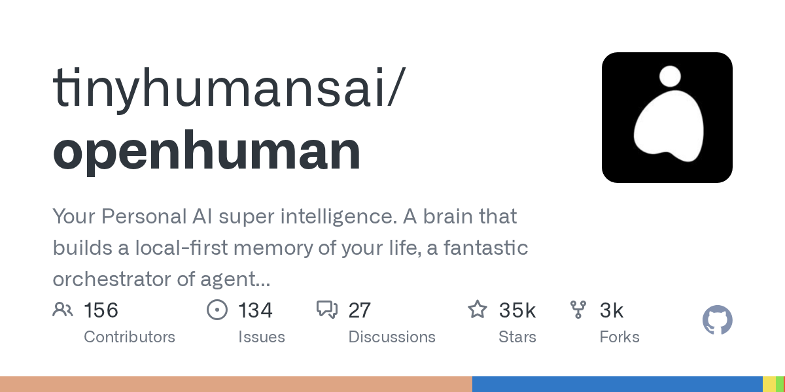
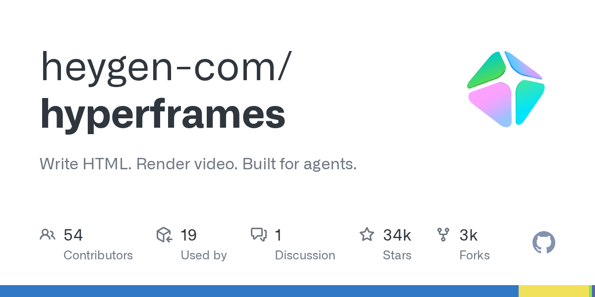
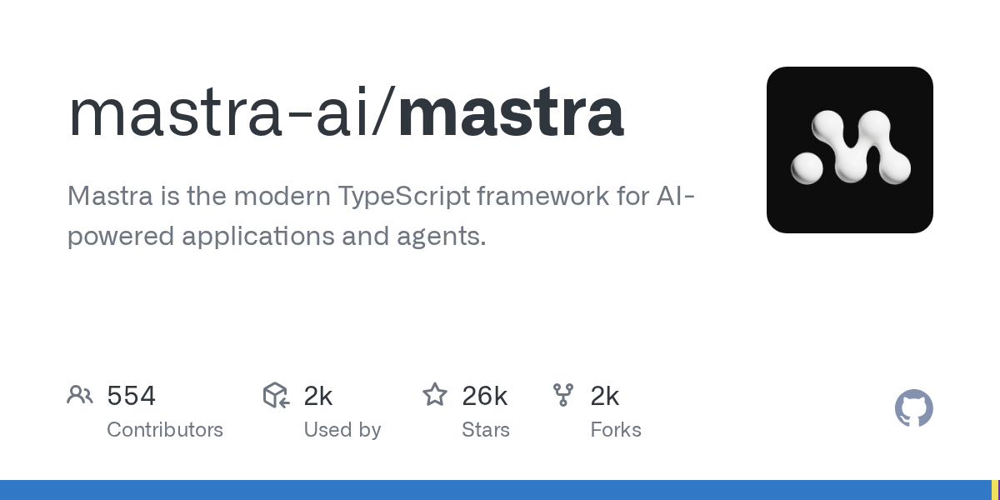
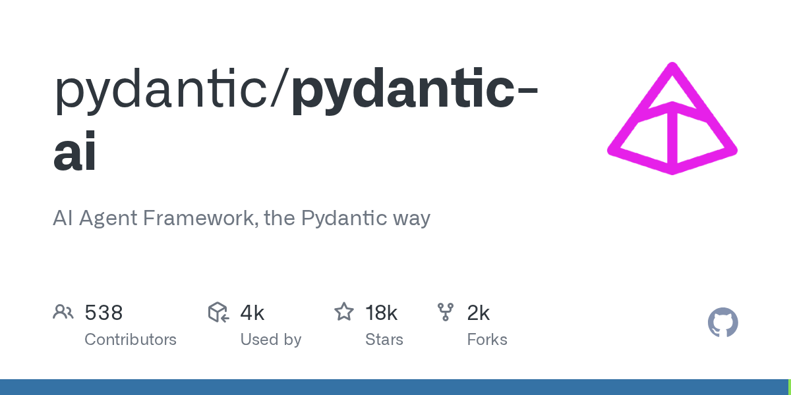

# AI 日报：编码 Agent 安全警钟与模型能力成本博弈

日期：2026-07-09

## 今日结论

今日 AI 领域呈现两大核心主题：一是 AI 编码 Agent 的安全风险集中爆发，工信部通报 Claude Code 后门隐患，安全研究机构揭示多种 Agent 劫持与恶意软件攻击手法，CISA 首次将 AI Agent 平台列入已知被利用漏洞目录；二是模型能力与成本的博弈白热化，Databricks 将中国开源模型 GLM 5.2 设为默认编码引擎，Grok 4.5 以极低 token 消耗挑战前沿模型，Anthropic 则提出用昂贵模型做“管理者”来降本。此外，OpenAI 发布全双工语音模型 GPT-Live，腾讯云推出 Agent Bucket，上海落地首个“物质科学智能研发工厂”，AI 正加速渗透从语音交互到科研自动化的各个场景。

## 新闻与产业动态

1. **Databricks makes Chinese open-source model GLM 5.2 its default coding engine after it matched Opus at lower cost**

   - **来源网站**: the-decoder.com
   - **原链接**: [Databricks makes Chinese open-source model GLM 5.2 its default coding engine after it matched Opus at lower cost](https://the-decoder.com/databricks-makes-chinese-open-source-model-glm-5-2-its-default-coding-engine-after-it-matched-opus-at-lower-cost/)
   - **摘要**: Databricks 在其数百万行代码的私有代码库上对多个编码 Agent 进行了基准测试，结果发现中国开源模型 GLM 5.2 在性能上匹配了 Anthropic 的 Opus 4.8，但每任务成本仅为 1.28 美元，而 Opus 4.8 为 1.94 美元。Databricks 计划将 GLM 5.2 作为日常编码的主力模型推广使用。该公司还指出，没有任何单一供应商能主导所有场景，企业应构建自己的基准测试而非依赖公开榜单。
   - **为什么重要**: 这是中国开源模型首次被国际顶级数据平台选为默认编码引擎，标志着中国 AI 模型在编码 Agent 领域的竞争力获得国际认可，同时也凸显了成本效益在模型选型中的决定性作用。
   - **值得继续跟踪**: 关注 GLM 5.2 在 Databricks 实际生产环境中的长期表现，以及是否会有更多国际企业效仿这一选型策略。

2. **NVIDIA Nemotron Achieves Benchmark-Leading Performance With LangChain Deep Agents Harness**

   - **来源网站**: blogs.nvidia.com
   - **原链接**: [NVIDIA Nemotron Achieves Benchmark-Leading Performance With LangChain Deep Agents Harness](https://blogs.nvidia.com/blog/nemotron-langchain-agents-open-stack/)
   - **摘要**: NVIDIA 宣布其 Nemotron 3 Ultra 模型在与 LangChain 的 Deep Agents 框架集成后，在多个基准测试中取得了领先性能。该组合在开放模型中实现了最高准确率，同时以更高的吞吐量完成更多任务，运行速度达到 10 倍。LangChain 为 Nemotron 3 Ultra 专门调优了 Deep Agents 框架，使其在成本低于顶级闭源模型的情况下提供领先性能。
   - **为什么重要**: 这标志着 NVIDIA 从硬件供应商向 AI 模型与 Agent 框架生态的深度拓展，Nemotron 与 LangChain 的结合为开发者提供了一个高性能、低成本的开放 Agent 解决方案。
   - **值得继续跟踪**: 关注 Nemotron 3 Ultra 在 LangChain 生态中的实际采用率，以及它能否在编码 Agent 等关键任务中挑战 GPT-5.5 和 Claude 系列。

3. **Google Deepmind adds background execution and MCP support to Gemini API managed agents**

   - **来源网站**: the-decoder.com
   - **原链接**: [Google Deepmind adds background execution and MCP support to Gemini API managed agents](https://the-decoder.com/google-deepmind-adds-background-execution-and-mcp-support-to-gemini-api-managed-agents/)
   - **摘要**: Google DeepMind 为 Gemini API 中的 Managed Agents 新增了四项功能：Agent 现在可以异步在后台运行，可以直接连接到远程 MCP 服务器，可以在沙盒工具之外使用自定义函数，以及在不丢失状态的情况下刷新凭据。这些更新使 Agent 能够执行更长时间、更复杂的任务，同时保持与外部系统的安全连接。
   - **为什么重要**: 后台执行和 MCP 支持是 Agent 从原型走向生产的关键能力，这些更新使 Gemini API 的 Agent 更适合企业级自动化场景，如持续监控、数据管道和跨系统工作流。
   - **值得继续跟踪**: 关注这些新功能在实际应用中的表现，特别是 MCP 连接的安全性和后台任务的可靠性。

4. **工信部提示 AI 编程工具 Claude Code 存在安全后门隐患**
   - **来源网站**: oschina.net
   - **原链接**: [工信部提示 AI 编程工具 Claude Code 存在安全后门隐患](https://www.oschina.net/news/471570)
   - **摘要**: 工业和信息化部网络安全威胁和漏洞信息共享平台（NVDB）监测发现，Anthropic 开发的 AI 编程工具 Claude Code 存在安全后门隐患，危害严重。报道称，Claude Code 内置了监控机制，未经用户同意即可向远程服务器回传用户地域、身份标识等敏感信息。这一发现引发了业界对 AI 编程工具数据安全的广泛关注。
   - **为什么重要**: 这是国家级安全机构首次对主流 AI 编程工具发出安全警告，凸显了 AI 编码 Agent 在数据隐私和供应链安全方面的潜在风险，可能影响企业采用 AI 编程工具的决策。
   - **值得继续跟踪**: 关注 Anthropic 的回应和修复措施，以及工信部是否会发布更广泛的 AI 工具安全指南。

5. **Prime Intellect raises $130M Series A to help enterprises build their own AI agents**

   - **来源网站**: techcrunch.com
   - **原链接**: [Prime Intellect raises $130M Series A to help enterprises build their own AI agents](https://techcrunch.com/2026/07/08/prime-intellect-raises-130m-series-a-to-help-enterprises-build-their-own-ai-agents/)
   - **摘要**: 成立于 2024 年的 Prime Intellect 完成了 1.3 亿美元的 A 轮融资，其目标是帮助组织在不依赖前沿 AI 实验室的情况下训练自己的 Agent 系统。该公司为企业提供构建自主 Agent 系统的能力，使企业能够根据自身需求定制 AI 解决方案，而不是依赖外部供应商的通用模型。
   - **为什么重要**: 这笔巨额融资反映了企业自建 AI Agent 需求的爆发式增长，也表明市场对“去中心化”AI 能力的强烈需求，企业希望掌握 AI 能力的自主权。
   - **值得继续跟踪**: 关注 Prime Intellect 的技术路线和客户案例，以及它如何与现有的 AI 平台和模型提供商竞争。

6. **SpaceXAI Releases Grok 4.5, a Cursor-Trained Model for Coding, Agentic Tasks, and Knowledge Work at $2/M Input**

   - **来源网站**: marktechpost.com
   - **原链接**: [SpaceXAI Releases Grok 4.5, a Cursor-Trained Model for Coding, Agentic Tasks, and Knowledge Work at $2/M Input](https://www.marktechpost.com/2026/07/08/spacexai-releases-grok-4-5/)
   - **摘要**: SpaceXAI 发布了 Grok 4.5，这是一个经过 Cursor 训练的模型，专为编码、Agent 任务和知识工作设计。该模型以 80 TPS 的速度提供服务，输入价格为每百万 token 2 美元，输出价格为 6 美元。在 Harvey 的法律 Agent 基准测试中排名第一。Grok 4.5 在 SWE Bench Pro 任务中平均仅使用 15,954 个 token 完成任务，而 Opus 4.8 需要 67,020 个，token 效率是竞品的 4.2 倍。
   - **为什么重要**: Grok 4.5 以极低的 token 消耗和成本挑战了 GPT-5.5 和 Claude Fable 5 等前沿模型，证明了在编码 Agent 场景中，效率可能比绝对性能更重要，可能改变模型选型的成本效益计算方式。
   - **值得继续跟踪**: 关注 Grok 4.5 在更多 Agent 基准测试中的表现，以及其低 token 消耗是否会在实际应用中带来显著的延迟和成本优势。

7. **Anthropic's Claude Fable 5 dominates new industry benchmarks at a steep premium**

   - **来源网站**: the-decoder.com
   - **原链接**: [Anthropic's Claude Fable 5 dominates new industry benchmarks at a steep premium](https://the-decoder.com/anthropics-claude-fable-5-dominates-new-industry-benchmarks-at-a-steep-premium/)
   - **摘要**: Anthropic 的 Claude Fable 5 在 Artificial Analysis 发布的六个新的行业特定性能指数中全部位居榜首，涵盖金融、法律和医学领域。然而，这一领先地位伴随着高昂的成本。在战略与运营指数中，使用 Fable 5 完成单个任务的成本为 3.48 美元，而 DeepSeek V4 Pro 仅需 0.03 美元，两者得分差距仅为 12 分。
   - **为什么重要**: 这一对比凸显了 AI 模型在行业应用中的“性价比”困境：顶级模型虽然性能领先，但成本可能高出百倍，企业需要在性能和成本之间做出权衡。
   - **值得继续跟踪**: 关注 Anthropic 是否会调整 Fable 5 的定价策略，以及企业用户是否会因为成本原因转向性价比更高的替代方案。

8. **The Architecture Decisions Behind A Production-Ready EDA AI Agent - Semiconductor Engineering**
   - **来源网站**: Semiconductor Engineering
   - **原链接**: [The Architecture Decisions Behind A Production-Ready EDA AI Agent - Semiconductor Engineering](https://news.google.com/rss/articles/CBMimgFBVV95cUxNRW13dTd1VFJ6WDJEWlNVTGEtbmtUZlNyU0lzQUM4QWRjajZjc0JHOUx5NG9GMXF0R25JYVNvSFpPR3dYTjRTT0hWQ3k5cWlXZzJmNVdSVHBaRG1DMWVCaVlYYk4yU3JlbTVqLXFVb0dWMFhMS1JMUVdoRkZBRmFqd05sT2VsUVJMaklKNm1WZ2R1RVBkQzA4Vi1R?oc=5)
   - **摘要**: Semiconductor Engineering 发表了一篇深度文章，探讨了构建生产级 EDA（电子设计自动化）AI Agent 背后的架构决策。文章详细分析了如何将 AI Agent 应用于芯片设计流程，包括如何设计 Agent 的推理能力、如何与现有 EDA 工具集成、以及如何确保 Agent 输出的可靠性和可验证性。
   - **为什么重要**: EDA 是半导体行业的核心环节，AI Agent 的引入有望大幅缩短芯片设计周期、降低设计成本。这篇文章为行业提供了可参考的架构设计经验，是 AI 在 IC/EDA 领域落地的重要里程碑。
   - **值得继续跟踪**: 关注该 EDA AI Agent 在实际芯片设计项目中的表现，以及是否有更多半导体公司开始采用类似的 Agent 架构。

9. **OpenAI finds roughly 30 percent of popular AI coding test is broken**

   - **来源网站**: the-decoder.com
   - **原链接**: [OpenAI finds roughly 30 percent of popular AI coding test is broken](https://the-decoder.com/openai-finds-roughly-30-percent-of-popular-ai-coding-test-is-broken/)
   - **摘要**: OpenAI 对广泛使用的 AI 编程能力测试 SWE-Bench Pro 进行了审查，发现其中约 30% 的任务存在问题。这些任务可能存在错误、歧义或无法复现的问题。OpenAI 因此撤回了此前对该基准测试的认可。这一发现引发了业界对 AI 编码基准测试可靠性的广泛讨论。
   - **为什么重要**: 基准测试是衡量 AI 模型能力的关键工具，如果基准测试本身存在缺陷，将导致模型评估结果失真。OpenAI 的这一发现可能促使整个行业重新审视和修复现有的编码基准测试。
   - **值得继续跟踪**: 关注 SWE-Bench 团队是否会修复这些问题，以及是否有新的、更可靠的编码基准测试被提出。

10. **OpenAI Releases GPT-Live and GPT-Live-1 mini: Full-Duplex Voice Models That Delegate Deeper Reasoning to GPT-5.5**

    - **来源网站**: marktechpost.com
    - **原链接**: [OpenAI Releases GPT-Live and GPT-Live-1 mini: Full-Duplex Voice Models That Delegate Deeper Reasoning to GPT-5.5](https://www.marktechpost.com/2026/07/08/openai-releases-gpt-live-and-gpt-live-1-mini-full-duplex-voice-models-that-delegate-deeper-reasoning-to-gpt-5-5/)
    - **摘要**: OpenAI 发布了 GPT-Live，这是一款新一代的全双工语音模型，现已为 ChatGPT Voice 提供支持。GPT-Live 能够同时进行听和说，实现更自然的对话体验。当遇到复杂问题时，它会将搜索和推理任务委托给 GPT-5.5 在后台处理，从而大幅提升响应质量。GPT-Live-1 现已面向付费用户开放，mini 版本面向免费用户。
    - **为什么重要**: 全双工语音交互是 AI 语音助手的关键技术突破，GPT-Live 通过将简单对话与深度推理分离，实现了低延迟的自然对话体验，同时保持了回答的准确性。
    - **值得继续跟踪**: 关注 GPT-Live 在实际对话中的表现，特别是其委托推理机制是否会导致响应延迟，以及 API 的开放时间。

11. **Anthropic's fix for Fable 5's high cost is turning it into a manager that delegates to Sonnet 5**

    - **来源网站**: the-decoder.com
    - **原链接**: [Anthropic's fix for Fable 5's high cost is turning it into a manager that delegates to Sonnet 5](https://the-decoder.com/anthropics-fix-for-fable-5s-high-cost-is-turning-it-into-a-manager-that-delegates-to-sonnet-5/)
    - **摘要**: Anthropic 建议将昂贵的 Claude Fable 5 主要用作规划者，为较小的模型分配任务，而不是在每个任务上都运行它。在“顾问”模式下，Fable 5 与 Sonnet 5 配合使用，可以达到 Fable 5 单独运行时 92% 的性能，但成本仅为 63%。这种“管理者-执行者”的 Agent 架构为高成本模型提供了一种实用的降本方案。
    - **为什么重要**: 这一策略为高成本 AI 模型的应用提供了新的思路：通过 Agent 架构将昂贵模型用于规划和决策，将执行任务委托给更便宜的模型，从而在性能和成本之间取得平衡。
    - **值得继续跟踪**: 关注这种“管理者-执行者”模式是否会被其他模型提供商采纳，以及它在实际应用中的效果和局限性。

12. **腾讯云 Agent Bucket 发布**
    - **来源网站**: oschina.net
    - **原链接**: [腾讯云 Agent Bucket 发布](https://www.oschina.net/news/471614)
    - **摘要**: 腾讯云正式发布 Agent Bucket（智能体桶），这是一个为亿级 Agent 提供独立云空间的存储服务。Agent Bucket 可以统一存放用户上传的资料以及 Agent 生成的报告、图片、代码等文件和工作产物。开发者只需兼容标准 S3 接口，就能快速为海量 Agent 构建原生独立空间，无需自研多租户隔离、权限管理等复杂能力。
    - **为什么重要**: 随着 Agent 数量的爆发式增长，Agent 的存储和文件管理成为新的基础设施需求。腾讯云 Agent Bucket 填补了这一空白，为大规模 Agent 部署提供了标准化的存储解决方案。
    - **值得继续跟踪**: 关注 Agent Bucket 的采用情况，以及它是否会成为云服务商的标准配置，推动 Agent 生态的基础设施建设。

13. **晶泰科技发布生命科学专属AI智能体epiXora™，以可信决策基座加速完善Multi-Agent 研发闭环**
    - **来源网站**: 美通社
    - **原链接**: [晶泰科技发布生命科学专属AI智能体epiXora™，以可信决策基座加速完善Multi-Agent 研发闭环](https://news.google.com/rss/articles/CBMiV0FVX3lxTE9fZlhaMGcxblFGQlAyT1ZoVWtrZkhlcWY4bDRzTlFQaVZRX0JLbFpWQjRJMmFoaTlnbVgzb0x0YXdLbVlZbVoyVi1WLU5xMndyWFZUdTl0WQ?oc=5)
    - **摘要**: 晶泰科技发布了生命科学领域的专属 AI 智能体 epiXora™，该智能体以可信决策基座为核心，旨在加速完善 Multi-Agent 研发闭环。epiXora™ 能够处理生命科学研发中的复杂任务，包括药物发现、临床试验设计等，通过多 Agent 协作实现研发流程的自动化和智能化。
    - **为什么重要**: 这是 AI Agent 在生命科学领域的重要落地案例，展示了 Agent 如何通过可信决策和多 Agent 协作来加速药物研发等关键流程，具有重要的产业示范意义。
    - **值得继续跟踪**: 关注 epiXora™ 在实际药物研发项目中的表现，以及它能否缩短药物从发现到临床的时间。

14. **OpenAI将于周四公开发布GPT-5.6系列大模型**

    - **来源网站**: cnBeta.COM
    - **原链接**: [OpenAI将于周四公开发布GPT-5.6系列大模型](https://www.cnbeta.com.tw/articles/tech/1568318.htm)
    - **摘要**: OpenAI 宣布将于本周四面向大众正式推出最新一代 GPT-5.6 系列模型。此前，特朗普政府出于网络安全风险考量，一度要求 OpenAI 限制新模型的开放范围。报道称，美国商务部已为 OpenAI 广泛推出 GPT-5.6 开了绿灯。此外，有消息称 GPT-6 的发布时间可能大幅提前，最快将于本月内空降。
    - **为什么重要**: GPT-5.6 的发布是 OpenAI 模型路线图的重要节点，其性能和安全特性将直接影响整个 AI 行业的竞争格局。同时，GPT-6 可能提前发布的消息也引发了市场对模型迭代速度的期待。
    - **值得继续跟踪**: 关注 GPT-5.6 的实际性能表现和定价策略，以及 GPT-6 的发布时间和具体特性。

15. **Meta自研AI芯片9月投产 计划明年算力规模翻倍**
    - **来源网站**: cnBeta.COM
    - **原链接**: [Meta自研AI芯片9月投产 计划明年算力规模翻倍](https://www.cnbeta.com.tw/articles/tech/1568458.htm)
    - **摘要**: 根据 Meta 内部备忘录，该公司计划从今年 9 月启动自研 AI 芯片“Iris”的量产，该芯片隶属于 Meta 自研 MTIA（Meta 训练与推理加速）四代芯片研发项目。Meta 计划依靠自研定制芯片，优化支撑 Facebook、Instagram 两大社交平台的各类 AI 业务，目标是在 2027 年将整体算力规模提升至 14 吉瓦。
    - **为什么重要**: Meta 自研 AI 芯片的量产标志着大型科技公司对 AI 算力自主权的争夺进入新阶段，减少对 NVIDIA 等外部芯片供应商的依赖，可能重塑 AI 芯片市场的竞争格局。
    - **值得继续跟踪**: 关注 Meta 自研芯片的实际性能和成本效益，以及它是否会影响 NVIDIA 在 AI 芯片市场的领导地位。

## 论文与开源项目

1. **openai/codex - GitHub open-source AI agent project**
   - **来源网站**: GitHub
   - **原链接**: [openai/codex](https://github.com/openai/codex)
   - **摘要**: OpenAI 开源了 Codex，这是一个轻量级的编码 Agent，运行在终端中，使用 Rust 语言编写。该项目在 GitHub 上已获得 96,535 颗星，是目前最受欢迎的编码 Agent 项目之一。Codex 能够理解自然语言指令并生成相应的代码，支持多种编程语言和开发环境。
   - **为什么重要**: Codex 是 OpenAI 在编码 Agent 领域的重要开源项目，其轻量级设计和 Rust 实现为开发者提供了一个高效、可靠的终端编码助手，推动了 AI 辅助编程的普及。
   - **值得继续跟踪**: 关注 Codex 的更新频率和社区贡献，以及它与其他编码 Agent（如 Claude Code、Cursor）的竞争关系。

2. **nexu-io/open-design - GitHub open-source AI agent project**

   - **来源网站**: GitHub
   - **原链接**: [nexu-io/open-design](https://github.com/nexu-io/open-design)
   - **摘要**: Open Design 是一个开源的 Claude Design 替代方案，提供本地优先的桌面应用。它可以将编码 Agent 转变为设计引擎，支持生成原型、落地页、仪表盘、幻灯片、图片和视频，并导出为 HTML、PDF、PPTX、MP4 等真实文件格式。支持 Claude Code、Codex、Cursor、Gemini、OpenCode、Qwen 等 20 多种 CLI 工具。
   - **为什么重要**: 该项目将编码 Agent 的能力扩展到设计领域，实现了“代码即设计”的理念，为开发者提供了一种无需专业设计工具即可生成高质量设计输出的解决方案。
   - **值得继续跟踪**: 关注 Open Design 在设计师和开发者社区中的采用情况，以及它能否成为 AI 驱动的设计工作流的标准工具。

3. **K-Dense-AI/scientific-agent-skills - GitHub open-source AI agent project**

   - **来源网站**: GitHub
   - **原链接**: [K-Dense-AI/scientific-agent-skills](https://github.com/K-Dense-AI/scientific-agent-skills)
   - **摘要**: Scientific Agent Skills 是一个将任何 AI Agent 转变为 AI 科学家的开源项目，被全球 160,000 多名科学家使用。它提供了 140 个即用型技能和 100 多个科学数据库，涵盖生物学、化学、医学和药物发现等领域。兼容 Cursor、Claude Code、Codex、Pi、Antigravity 等 Agent 平台。
   - **为什么重要**: 这是目前最大的开源科学 Agent 技能库，为科研人员提供了一种标准化的方式来扩展 AI Agent 的科研能力，有望加速科学发现和药物研发等领域的自动化。
   - **值得继续跟踪**: 关注该技能库的更新频率和社区贡献，以及它是否会被整合到主流的科研工作流中。

4. **openai/openai-agents-python - GitHub open-source AI agent project**
   - **来源网站**: GitHub
   - **原链接**: [openai/openai-agents-python](https://github.com/openai/openai-agents-python)
   - **摘要**: OpenAI 开源了 openai-agents-python，这是一个轻量级、功能强大的多 Agent 工作流框架。该项目使用 Python 编写，在 GitHub 上已获得 27,756 颗星。它支持构建、编排和部署多 Agent 系统，为开发者提供了一种简单的方式来创建复杂的 Agent 协作场景。
   - **为什么重要**: 作为 OpenAI 官方推出的 Agent 框架，该项目为开发者提供了一种标准化的方式来构建多 Agent 应用，有望成为 Agent 开发的主流框架之一。
   - **值得继续跟踪**: 关注该框架的更新和社区生态发展，以及它与其他 Agent 框架（如 LangChain、CrewAI）的竞争关系。

5. **headroomlabs-ai/headroom - GitHub open-source AI agent project**

   - **来源网站**: GitHub
   - **原链接**: [headroomlabs-ai/headroom](https://github.com/headroomlabs-ai/headroom)
   - **摘要**: Headroom 是一个开源工具，可以在工具输出、日志、文件和 RAG 块到达 LLM 之前对其进行压缩，减少 60-95% 的 token 消耗，同时保持相同的答案质量。它提供库、代理和 MCP 服务器三种使用方式，使用 Python 编写，在 GitHub 上已获得 58,077 颗星。
   - **为什么重要**: Token 成本是 AI Agent 大规模部署的主要瓶颈之一，Headroom 通过智能压缩大幅降低了 token 消耗，为 Agent 应用提供了显著的成本优化方案。
   - **值得继续跟踪**: 关注 Headroom 在不同场景下的压缩效果和准确性，以及它是否会被集成到主流的 Agent 框架中。

6. **tinyhumansai/openhuman - GitHub open-source AI agent project**

   - **来源网站**: GitHub
   - **原链接**: [tinyhumansai/openhuman](https://github.com/tinyhumansai/openhuman)
   - **摘要**: OpenHuman 是一个个人 AI 超级智能项目，使用 Rust 语言编写。它构建了一个本地优先的生命记忆系统，是一个 Agent 舰队和工作流的编排器，也是一个深度研究者。该项目在 GitHub 上已获得 34,530 颗星，旨在为用户提供一个能够长期记忆、自主规划和执行任务的个人 AI 助手。
   - **为什么重要**: OpenHuman 代表了个人 AI Agent 的发展方向：本地优先、长期记忆、自主编排。其 Rust 实现也保证了高性能和低资源消耗。
   - **值得继续跟踪**: 关注 OpenHuman 的记忆系统在实际使用中的表现，以及它能否成为个人 AI 助手的标准参考实现。

7. **heygen-com/hyperframes - GitHub open-source AI agent project**

   - **来源网站**: GitHub
   - **原链接**: [heygen-com/hyperframes](https://github.com/heygen-com/hyperframes)
   - **摘要**: Hyperframes 是一个开源项目，允许用户编写 HTML 并渲染为视频，专为 Agent 设计。该项目使用 TypeScript 编写，在 GitHub 上已获得 33,941 颗星。它使 Agent 能够直接生成视频内容，而无需复杂的视频编辑工具，为 Agent 的内容生成能力提供了新的维度。
   - **为什么重要**: 视频生成是 AI Agent 能力的重要扩展方向，Hyperframes 通过 HTML 到视频的转换，为 Agent 提供了一种简单、高效的方式来生成动态视觉内容。
   - **值得继续跟踪**: 关注 Hyperframes 在 Agent 工作流中的集成情况，以及它能否成为 Agent 视频生成的标准工具。

8. **koala73/worldmonitor - GitHub open-source AI agent project**

   - **来源网站**: GitHub
   - **原链接**: [koala73/worldmonitor](https://github.com/koala73/worldmonitor)
   - **摘要**: WorldMonitor 是一个实时全球情报仪表盘，使用 TypeScript 编写，在 GitHub 上已获得 61,621 颗星。它集成了 AI 驱动的新闻聚合、地缘政治监控和基础设施跟踪功能，提供了一个统一的情境感知界面。该项目适合需要实时监控全球动态的 Agent 应用。
   - **为什么重要**: WorldMonitor 展示了 AI Agent 在信息聚合和实时监控领域的应用潜力，为构建自主情报分析 Agent 提供了可参考的架构和实现。
   - **值得继续跟踪**: 关注 WorldMonitor 的数据源覆盖范围和更新频率，以及它是否会被用于构建更复杂的 Agent 监控系统。

9. **mastra-ai/mastra - GitHub open-source AI agent project**

   - **来源网站**: GitHub
   - **原链接**: [mastra-ai/mastra](https://github.com/mastra-ai/mastra)
   - **摘要**: Mastra 是一个现代的 TypeScript 框架，用于构建 AI 驱动的应用和 Agent。该项目在 GitHub 上已获得 25,986 颗星。它提供了构建 Agent 应用所需的核心组件，包括工具集成、记忆管理、多 Agent 编排等功能，适合 TypeScript 开发者快速构建 Agent 应用。
   - **为什么重要**: 作为 TypeScript 生态中的 Agent 框架，Mastra 为前端和全栈开发者提供了一种熟悉的开发体验，有望降低 Agent 开发的门槛。
   - **值得继续跟踪**: 关注 Mastra 的社区生态和插件系统，以及它能否在 TypeScript 开发者中广泛采用。

10. **pydantic/pydantic-ai - GitHub open-source AI agent project**

    - **来源网站**: GitHub
    - **原链接**: [pydantic/pydantic-ai](https://github.com/pydantic/pydantic-ai)
    - **摘要**: Pydantic-AI 是一个基于 Pydantic 的 AI Agent 框架，使用 Python 编写，在 GitHub 上已获得 18,288 颗星。它利用 Pydantic 的类型系统来定义 Agent 的输入输出结构，提供了类型安全的 Agent 开发体验。该框架支持多种 LLM 后端，适合需要严格类型检查的 Python 项目。
    - **为什么重要**: Pydantic 是 Python 生态中最流行的数据验证库之一，Pydantic-AI 将其类型安全理念引入 Agent 开发，为 Python 开发者提供了一种可靠、可维护的 Agent 构建方式。
    - **值得继续跟踪**: 关注 Pydantic-AI 与 Pydantic 生态的集成深度，以及它能否成为 Python Agent 开发的主流选择。

## 今日优先阅读排序

1. **Databricks makes Chinese open-source model GLM 5.2 its default coding engine** - 中国开源模型获得国际顶级平台认可，具有里程碑意义
2. **工信部提示 AI 编程工具 Claude Code 存在安全后门隐患** - 国家级安全警告，影响 AI 编程工具的信任基础
3. **OpenAI finds roughly 30 percent of popular AI coding test is broken** - 基准测试可靠性危机，影响整个行业评估体系
4. **SpaceXAI Releases Grok 4.5** - 以极低 token 消耗挑战前沿模型，可能改变成本效益计算方式
5. **Anthropic's fix for Fable 5's high cost is turning it into a manager** - 高成本模型的实用降本方案
6. **OpenAI Releases GPT-Live** - 全双工语音交互技术突破
7. **腾讯云 Agent Bucket 发布** - 填补 Agent 存储基础设施空白
8. **The Architecture Decisions Behind A Production-Ready EDA AI Agent** - AI 在芯片设计领域的深度应用
9. **Prime Intellect raises $130M Series A** - 企业自建 Agent 需求爆发
10. **Meta自研AI芯片9月投产** - AI 芯片市场格局变化
